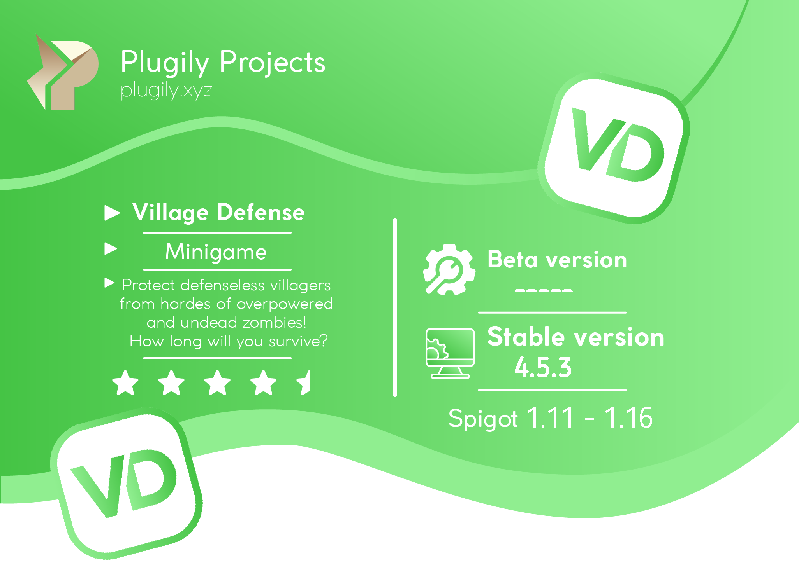

---
Official Plugily Projects Wiki of the Village Defense plugin

## Get started

| [Commands and Permissions](setup/cmd-perms.md) | [Simple arena setup](setup/simple-setup.md) | [Free Maps](setup/free-maps.md) | [Developers API](development/developer-api.md) | [FAQ](support/faq.md) |
| :--- | :--- | :--- | :--- | :--- |
|  |  |  |  |  |
| Commands and permissions | How to create arena tutorial | Frequently asked questions | Some stuff for developers | Frequent problems and tips |

